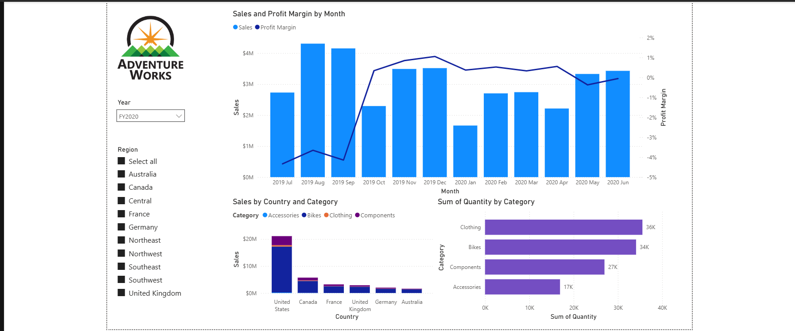
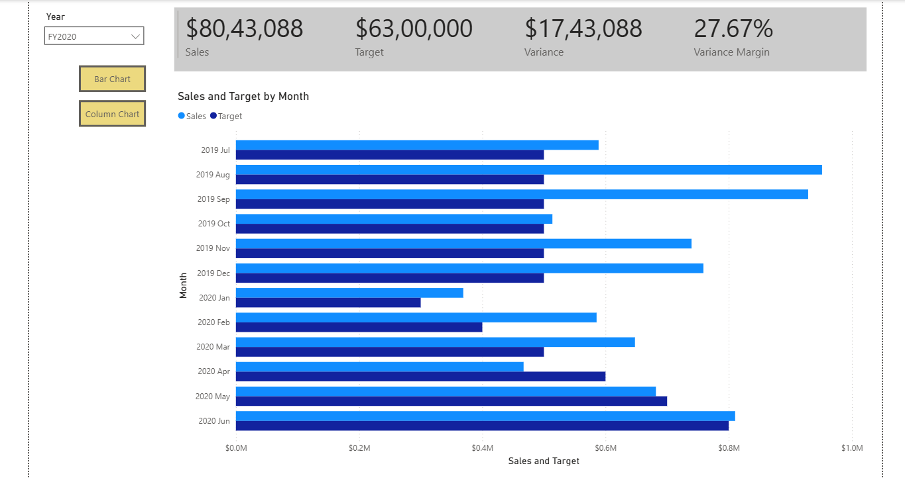
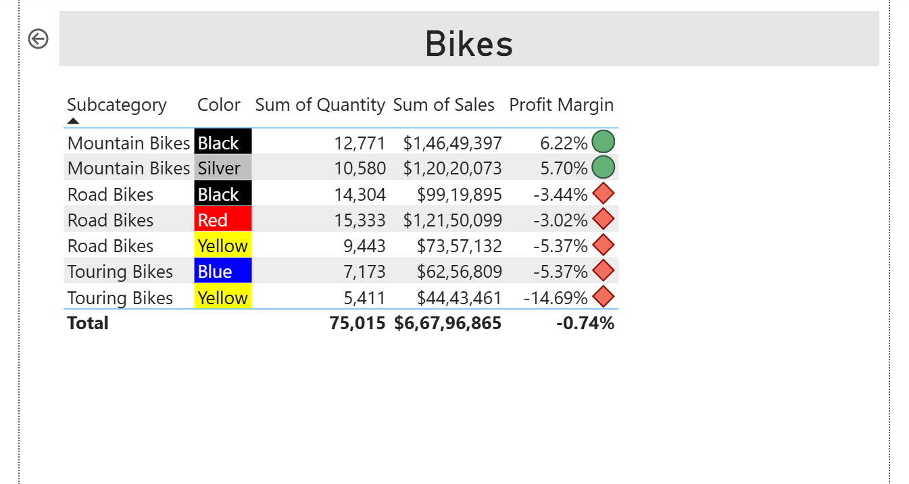
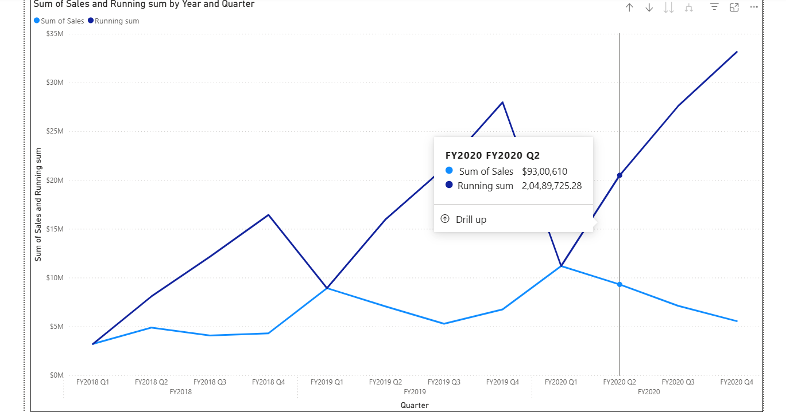
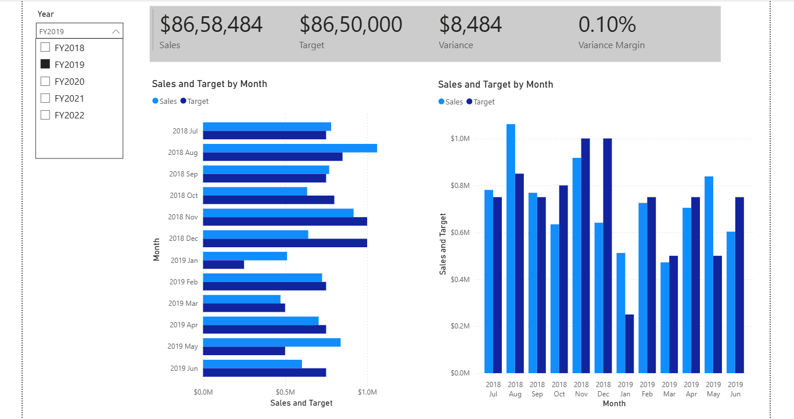

# Power BI Dashboards — Training Project

Completed Power BI training as part of the **Data Analysis Finishing School for 
Employability (Infosys Foundation & ICT Academy)**, covering data modeling, DAX 
measures, KPI tracking, drill-through navigation, and interactive report design 
using the AdventureWorks sales dataset.

## Skills Demonstrated
- DAX measures: running totals, variance vs. target, profit margin, time intelligence
- KPI cards and variance analysis dashboards
- Drill-through pages and conditional formatting (color-coded performance tables)
- Interactive filtering, slicers, and cross-page navigation
- Year-over-year and category-wise sales analysis

## Dashboard Screenshots

### 1. Overview Dashboard
Sales trends, profit margin, and category-wise breakdown by country.

### 2. KPI & Variance Dashboard
Sales vs. target tracking with variance and variance margin KPIs.

### 3. Product Drill-Through View
Product-level performance with conditional formatting (profit margin indicators).

### 4. Running Total / Cumulative Trend
Quarterly sales with running sum and interactive tooltips.

### 5. Year-over-Year Comparison
Monthly sales vs. target comparison across fiscal years.

